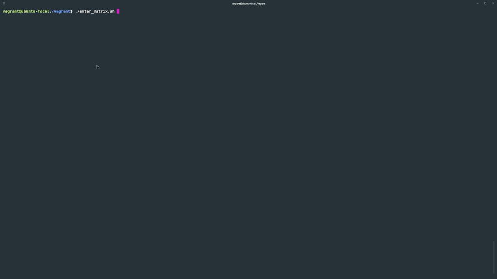

# matrix-shell
Duplicates the effect of the matrix movie in a terminal. Original authors: http://sourceforge.net/projects/matrixbashshell/


### Modifications:

- Adds Katakana Japanese characters; instead of symbols.
- Refactors code; Indentations, Renames, etc...
- Add comments explaining commands and options.
- Adds full screen terminal functionality.
- Refactors to absolute path use; script can run now from anywhere

### Development
##### Windows OS
> Dependencies: [vagrant](https://www.vagrantup.com/), [virtualbox](https://www.virtualbox.org/)
```
vagrant up
vagrant ssh
./enter_matrix.sh
```
